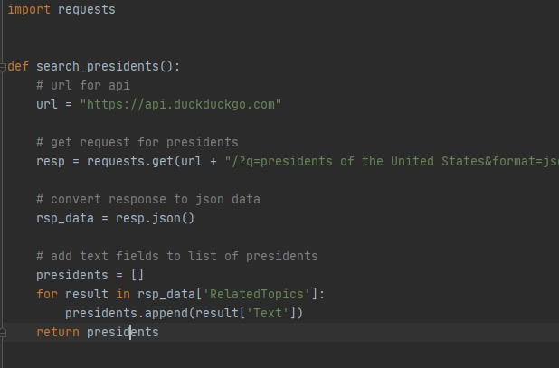
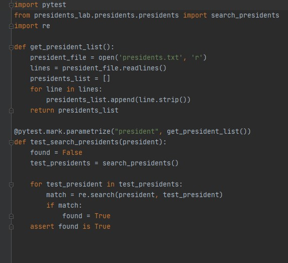
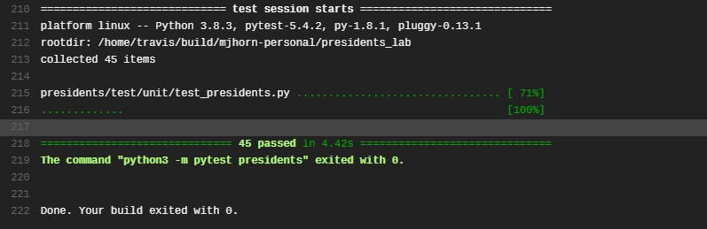

Presidents Lab:
Simple demonstration of scraping a duckduckgo api web search for a list of presidents of the United States, and then using pytest to check results.

[GitHub link](https://github.com/mjhorn-personal/presidents_lab):

Code for duckduckgo search

Code testing all 45 presidents were retrieved

pytest results on Travis

